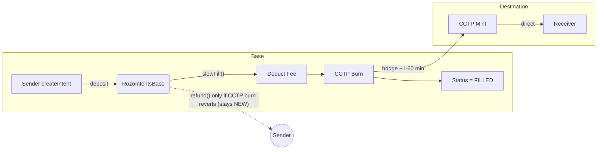

# SLOWFILLED

SlowFill is Rozo's on-chain fallback path for intents that cannot be matched immediately by a fast relayer. Instead of waiting for an off-chain filler, the contract itself pushes the user funds through a canonical bridge (initially CCTP on Base) and finalizes the intent as soon as the transfer is queued. This document explains how that path works and what each component is expected to implement.



**Key points:**
- SlowFill bypasses RozoIntents on destination. CCTP mints directly to receiver address.
- Once `slowFill()` succeeds (CCTP burn succeeds), status = FILLED. **No refund from RozoIntents possible.**
- If CCTP mint fails/stalls after burn, user must resolve via CCTP directly (using `refundAddress` set in CCTP payload).

## When SlowFill Runs

- **Caller:** Whitelisted relayer or Rozo ops bot can call `slowFill(intentId)` once an intent is `NEW` and still within its deadline.
- **Caller incentive:** Rozo ops bot pays gas as a service.
- **Preconditions:** The route must be marked as SlowFill-supported. Unsupported pairs revert.
- **Use case:** Lack of fast liquidity, or user explicitly opts into slower settlement (~1–60 min) to guarantee delivery.
- **Limitation:** Only EVM ↔ EVM routes supported (CCTP). Base ↔ Stellar not supported.

## SlowFill Route Configuration

SlowFill routes are stored on-chain and managed by admin. Routes support swap+bridge (e.g., USDT → USDC → bridge).

```solidity
// Storage: route key => bridge adapter address
// key = keccak256(abi.encodePacked(destinationChainId, sourceToken, destinationToken))
mapping(bytes32 => address) public slowFillBridges;

// Admin functions
function setSlowFillBridge(
    uint256 destinationChainId,
    address sourceToken,        // Token on source chain (e.g., Base USDT)
    bytes32 destinationToken,   // Token on destination chain (e.g., Arbitrum USDC)
    address bridgeAdapter       // Adapter that handles swap+bridge
) external onlyOwner;

function removeSlowFillBridge(
    uint256 destinationChainId,
    address sourceToken,
    bytes32 destinationToken
) external onlyOwner;
```

### Route Key Encoding

```solidity
bytes32 routeKey = keccak256(abi.encodePacked(
    destinationChainId,  // uint256
    sourceToken,         // address (source chain)
    destinationToken     // bytes32 (destination chain)
));
```

### Token Address Types

| Field | Type | Description |
|-------|------|-------------|
| `sourceToken` | `address` | EVM address on source chain |
| `destinationToken` | `bytes32` | Address on destination (bytes32 for cross-chain compatibility) |

### Supported Routes (Initial)

| Source | Destination | Source Token | Dest Token | Bridge |
|--------|-------------|--------------|------------|--------|
| Base | Ethereum | USDC | USDC | CCTP |
| Base | Arbitrum | USDC | USDC | CCTP |
| Base | Arbitrum | USDT | USDC | Swap+CCTP |
| Ethereum | Base | USDC | USDC | CCTP |

**Note:** Stellar SlowFill not supported until CCTP adds Stellar support.

## State Transitions

1. Sender calls `createIntent()` on Base. Intent is stored as `NEW` with funds custodied by RozoIntents.
2. Relayer/bot calls `slowFill()`.
   - RozoIntents checks support list, consumes the intent, and calls the configured bridge (e.g., CCTP burn/mint).
   - The contract locks in protocol fees exactly as in fast fills.
   - Status goes directly to `FILLED` because the contract now owns settlement responsibility; no `fill()` or `fillNotify()` will run afterward.
3. Intent cannot be refunded after successful `slowFill()`. If the bridge call reverts, status stays `NEW` and the sender may retry or call `refund()` after the deadline.

```
createIntent() -> NEW
NEW --slowFill()--> FILLED (bridge in flight)
```

## Flow Across Chains

**Note:** SlowFill only supports EVM ↔ EVM routes (where CCTP is available). Base ↔ Stellar uses Fast Fill only.

```
Base (source)                                 Arbitrum (destination)
1. Sender deposit via createIntent()          -
2. Relayer triggers slowFill()                -
   - Deduct protocol fee from sourceAmount    -
   - CCTP burn(receiver, destinationAmount)   -
   - Status = FILLED                          -
3.                                            CCTP mint → receiver address (direct)
```

### Components

- **RozoIntentsBase**
  - Validates intent is `NEW` and within deadline.
  - Checks route is SlowFill-supported via `slowFillBridges` mapping.
  - Deducts protocol fee from sourceAmount before bridging.
  - Calls bridge adapter with intent details.
  - Sets status to `FILLED` immediately (even before bridge confirms).
  - Emits `SlowFillTriggered(intentId, bridgeMessageId, caller)`.

- **Bridge Adapter (e.g., CCTPAdapter)**
  - Implements `IBridge` interface.
  - Handles swap (if needed) + bridge call.
  - Returns `bridgeMessageId` for tracking.

## IBridge Interface

```solidity
interface IBridge {
    /// @notice Bridge tokens to destination chain
    /// @param destinationChainId Target chain ID
    /// @param receiver Recipient on destination (bytes32 for cross-chain)
    /// @param sourceToken Token to bridge from (may be swapped)
    /// @param destinationToken Token receiver expects
    /// @param amount Amount to bridge (in destination token decimals)
    /// @param refundAddress Where to refund if bridge fails
    /// @return bridgeMessageId Unique ID for tracking the bridge tx
    function bridge(
        uint256 destinationChainId,
        bytes32 receiver,
        address sourceToken,
        bytes32 destinationToken,
        uint256 amount,
        address refundAddress
    ) external returns (bytes32 bridgeMessageId);
}
```

### CCTPAdapter Example

```solidity
contract CCTPAdapter is IBridge {
    ITokenMessenger public immutable tokenMessenger; // CCTP

    function bridge(
        uint256 destinationChainId,
        bytes32 receiver,
        address sourceToken,
        bytes32 destinationToken,
        uint256 amount,
        address refundAddress
    ) external returns (bytes32 bridgeMessageId) {
        // 1. If sourceToken != USDC, swap to USDC first
        // 2. Call CCTP burn
        uint64 nonce = tokenMessenger.depositForBurn(
            amount,
            destinationDomain,           // CCTP domain ID
            bytes32(receiver),           // recipient
            address(sourceToken)         // USDC
        );

        return bytes32(uint256(nonce));
    }
}
```

### Adapter Responsibilities

| Task | Handled By |
|------|------------|
| Swap source token → bridge token | Adapter |
| Call bridge (CCTP burn) | Adapter |
| Return tracking ID | Adapter |
| Handle bridge-specific encoding | Adapter |

- **CCTP Bridge**
  - Burns tokens on source chain.
  - Mints directly to receiver on destination (~1-60 min).
  - **No RozoIntents interaction on destination.**
  - No `fillNotify()` required.
  - If mint fails, user claims refund from CCTP using their `refundAddress`.

## Fees & Accounting

### Amount Calculation

Frontend calculates and user approves:
```
destinationAmount = sourceAmount - protocolFee - slippage
```

| Field | Description |
|-------|-------------|
| `sourceAmount` | What sender deposits (in source chain decimals) |
| `protocolFee` | Standard protocol fee (e.g., 3 bps) |
| `destinationAmount` | Minimum receiver expects (set by frontend/user) |

### How It Works

1. **Frontend** calculates `destinationAmount` using the formula above
2. **User** approves and calls `createIntent()` with both amounts
3. **Relayer/bot** checks: is `sourceAmount - protocolFee >= destinationAmount`?
   - If yes → triggers `slowFill()`
   - If no → ignores intent
4. **Contract** validates: `bridgeAmount >= destinationAmount` or reverts

**Key:** Frontend sets `destinationAmount`. Contract only validates. Rozo ops bot pays gas for `slowFill()` as a service.

### Fee Distribution

- Protocol fee accumulates in RozoIntents on source chain.
- `feeRecipient` can withdraw via `withdrawFees(token)`.
- **No relayer spread** - SlowFill is a service, not arbitrage.

### Example

```
- sourceAmount: 1000 USDC (6 decimals on Base)
- protocolFee: 3 USDC
- destinationAmount: 997 USDC
- CCTP burns: 997 USDC → mints to receiver
```

### Decimals

Contract does NOT convert decimals. Frontend must account for decimal differences between chains when setting `destinationAmount`.

## Failure Modes

| Scenario | Status | Result |
|----------|--------|--------|
| CCTP burn reverts | Stays `NEW` | Funds remain in RozoIntents; sender can retry slowFill or refund after deadline |
| Unsupported token/chain | Stays `NEW` | Revert with `SlowFillUnsupported` |
| CCTP burn succeeds, mint fails/stalls | `FILLED` | **No refund from RozoIntents.** User must claim from CCTP using `refundAddress`. Use `bridgeMessageId` from event to track. |

### Important: No Status Change on CCTP Failure After Burn

Once CCTP burn succeeds:
- RozoIntents status = `FILLED` (final)
- RozoIntents has no knowledge of CCTP mint status
- User is responsible for resolving with CCTP directly
- `intent.refundAddress` is set in CCTP payload so user can claim refund from CCTP if needed

## Security Invariants

- Only whitelisted relayers/bots can trigger `slowFill()` to prevent griefing via unnecessary bridge fees.
- Each intent can enter slowFill at most once; status guard enforces `NEW` → `FILLED`.
- Intent must be within deadline to slowFill.
- All events (`SlowFillTriggered`) must include intent IDs for off-chain tracking.

## Operational Notes

- **Expected latency:** 1–60 minutes, depending on CCTP finality.
- **User communication:** Inform users that refunds from RozoIntents are unavailable once slowFill succeeds. Funds are in CCTP's hands.
- **Success case:** Once CCTP mint succeeds, receiver has funds - no further action needed.
- **Failure monitoring:** If CCTP mint stalls, ops should use `bridgeMessageId` from `SlowFillTriggered` event to track and assist user with CCTP resolution.
- **CCTP refund:** User can claim refund directly from CCTP using their `refundAddress` if mint fails.
